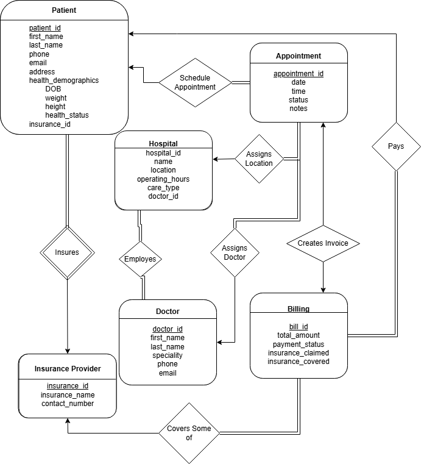

# MediTrack
IntroToDatabases Group Project : A Patient &amp; Appointment Management System

# ER - Diagram
found as file ER.png



# SQL Information
Our database schema is stored in meditrack(1).sql

A version with example data exists in meditrack(wdata).sql

**BOTH** are in 3nf

# Queries are contained in the DBS_queries.sql file

*They are intended to be run on the wdata database* since the reference real data points

However there structure is not dependent on the data outside of the specific fields like id, time, etc being specific instances

# Compiling the app & connecting database

open XAMPP & start **both** apache & mysql

create a new database called 'meditrack' and use the import tool to import meditrack(wdata).sql

run the flask app with:
```
python ./app.py
```