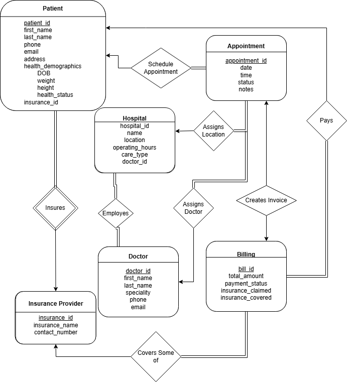

# MediTrack
IntroToDatabases Group Project : A Patient &amp; Appointment Management System

# ER - Diagram
found as file ER.png



# SQL Information
All sql data can be found in the folder labeled 'sql'

Our database schema is stored in meditrack(1).sql

A version with example data exists in meditrack(wdata).sql

**BOTH** are in 3nf

# Queries are contained in the DBS_queries.sql file

*They are intended to be run on the wdata database* since the reference real data points

However there structure is not dependent on the data outside of the specific fields like id, time, etc being specific instances

# Compiling the app & connecting database
You must run ```pip install -r requirements.txt``` <br><br>
The Database should be connected automatically

*Note It will only work while you are on Kent State's Network* - there is a local version in static (meditrack(As of 4-22-25))

run the flask app with:
```
python ./app.py
```